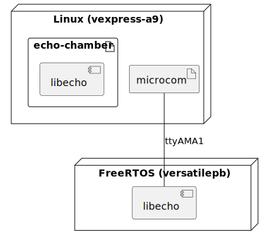

# Bob Embedded Example

This demo builds both a small Linux image and a FreeRTOS based image in one
project that share a common "echo" library that replies to your input. It's
meant as an example on how to use Bob to build multi-image code-sharing projects
to ensure API and ABI compatibility in heterogeneous and complex environments
with ease.

The central component, `libecho` ([recipe](./recipes/demo/libecho.yaml),
[source](https://github.com/BobBuildTool/bob-example-embedded-libecho)), is
built for both Linux and FreeRTOS. On Linux, the library is used by the
[`echo-chamber`](./recipes/demo/echo-chamber.yaml) application. The same code
running on FreeRTOS where it is attached to the serial port. This port is
connected to Linux as `/dev/ttyAMA1`.

Notice that the common library is declared by only one recipe. The position in
the dependency graph of a recipe determines how it is build. In particular, the
toolchain is inherited from downstream dependencies automatically.

This repository uses the [basement](https://github.com/BobBuildTool/basement)
and [basement-gnu-linux](https://github.com/BobBuildTool/basement-gnu-linux)
recipe layers. They provide common recipes for Linux, busybox, cross compilers
and standard build systems.
For more information about recipe layers and Bob's usage in general see [its
documentation](https://bob-build-tool.readthedocs.io/en/latest/index.html). If
you're interested in building containers and virtual machine images with Bob,
head over to the [container
example](https://github.com/BobBuildTool/bob-example-containers).

# Prerequisites

* A `x86_64` system with the regular development tools installed (GCC, make,
  Perl, ...)
* [Bob Build Tool](https://github.com/BobBuildTool/bob)
* Patience :coffee:

To actually run the built example you'll also need QEMU.

# How to build

Clone the recipes and build them with Bob:

    $ git clone https://github.com/BobBuildTool/bob-example-embedded.git
    $ cd bob-example-embedded
    $ bob layers update
    $ bob build demo::linux+freertos -j

# How to use

Just execute `run.sh` in the result (something like
`./work/demo/linux+freertos/dist/1/workspace/` but the number might differ)
directory. It will start the Linux system and you can interact with the FreeRTOS
system via `microcom`. Follow the instructions on the console. Both systems are
started in parallel. The UART of the FreeRTOS system is connected to `ttyAMA1`
in the Linux system.

# Contributions

Contributions are welcome in form of feedback, bug reports and code. If you want
to contribute in the form of code but are unsure about how to do things exactly,
feel free to open up a pull request and ask for help.
